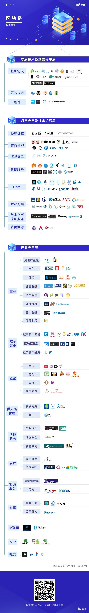

# 区块链技术树

## 树图

## 详解

### 底层硬件

**底层:**

- [NEO](https://neo.org/) -c# 创始人 达鸿飞 
- [Ethereum](https://www.ethereum.org/) - go 
- [量子链](https://qtum.org/zh) - c++ 

**硬件:**

- [嘉楠耘智](https://canaan.io/zh/)
- RockMiner
- [极路由](http://www.hiwifi.com/chain)
- [迅雷-链克](http://www.onethingcloud.com/)

### 应用扩展

快速计算：

- [lightning-network](https://lightning.network/)
- truebit
- raiden

智能合约：

- [秘猿科技](https://www.cryptape.com)
- [全息互信](http://www.pdx.life)
- SCRY.INFO

挖矿服务：

- MaidSafeCoin
- bitfury
- hashfast

信息安全：

- 万物链
- zeppelin
- gladius

数据服务：

- 公信宝
- 众享比特
- 矩阵元

BAAS：

- [百度Baas](https://chain.baidu.com)
- 趣链科技
- 快贝

解决方案：

- 海星区块链
- 塔链网络
- 网录科技

防伪溯源：

- 平台级别的防伪溯源项目一般基于区块链
- 物联网等相关技术辨别商品
- 产品的真假，解决中间链条不透明的问题。

### 行业

对于每一个技术的存活秘诀是寻找合适的应用场景。在这个行业应用层面的图谱表现了区块链技术赋能到各个行业中去的情况。现在应用最为成熟以及广泛的行业是数字货币与金融，这与区块链的起源有着密不可分的联系。

区块链项目在金融领域的探索主要集中在支付
- 房地产金融
- 企业金融
- 保险
- 资产管理
- 票据金融等领域。在国内，不仅是新兴区块链创业企业，如中国银联
- 招商
- 民生等银行和蚂蚁区块链
- 众安科技在内的科技巨头已经开始布局并落地了相应的平台与项目。利用区块链的去中心化
- 不可篡改的特性对于金融各个环节的风险有了更好的把控，从而降低了金融流程中的成本。

在数字货币这个领域衍生出了大量数字货币交易所
- 钱包和投资的项目。在国内，由于金融监管的严格管制，比特币交易等数字货币相关的领域在中国发展受到很大阻力。但在2017年上半年，央行成立了数字货币研究所，或在2018年下半年可看到中国的法定数字货币。

区块链应用较为早期的2C类业务主要衍生在娱乐社交领域。在音乐创作中区块链可以帮助创作者规避抄袭的争议。基于区块链做的虚拟偶像
- 游戏
- 直播等项目让虚拟财产交易和保护更加透明。

曾有机构预言供应链和物联网将是区块链迅猛发展的下一片沃土。这得益于区块链带来的交易共享性和不可篡改性，这提高了供应链在物流
- 资金流
- 信息流等实体协作沟通效率，改善了多方协作时的争议。

在能源领域最为广泛应用的是智能电网。针对每一度电用区块链可以从来源到使用建立完备的数字档案，为电站提供数据支持和资产评估依据。区块链还可以释放分布式资源的多余电力，如回购民用屋顶太阳能产生的冗余资源。

针对医疗的数据安全和患者隐私保护，区块链的匿名和去中心化的特性得到了很好的应用。这让医联体之间进行远程数据共享
- 分布式保障与存储管理更加安全。

在公益事业和农业中，应用最多的还是区块链的溯源能力，追溯善款的去向，让捐赠者安心；追溯农产品的来源，让食用者放心。

区块链的分布式存证让在法律层面主要体现在版权保护
- 证据保全和电子智能合同三个方面。对于版权保护，区块链让版权交易标准化成为可能；而对于电子证据来说，区块链实现了保真和验真。

