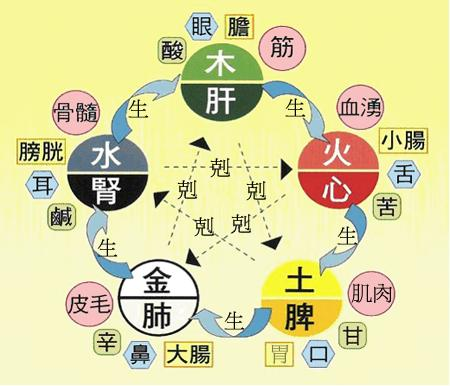

# 关于中医

## 学科分类

- 基础中医学：包括中医基础理论、中医诊断学、中药学、方剂学、内经、伤寒论、温病学、中国中医学史、中医各家学说等；
- 临床中医学：包括中医内科、中医外科、中医妇科、中医儿科、针灸科、中医骨伤科、推拿科、中医眼科、中医耳鼻咽喉科、中西医结合医学、气功科、中医护理等。

## 五行

中医传统的《五行学说》认为：金、木、水、火、土五行，分别对应肺、肝、肾、心、脾五脏，五脏对应的颜色则分别为白、青、黑、赤、黄。

| 金  | 木  | 水  | 火  | 土  |
| --- | --- | --- | --- | --- |
| 肺  | 肝  | 肾  | 心  | 脾  |
| 白  | 青  | 黑  | 赤  | 黄  |

{width="300"}

## 食疗

## 望闻问切

## 针灸

## 推拿

## 中药

## 医道
